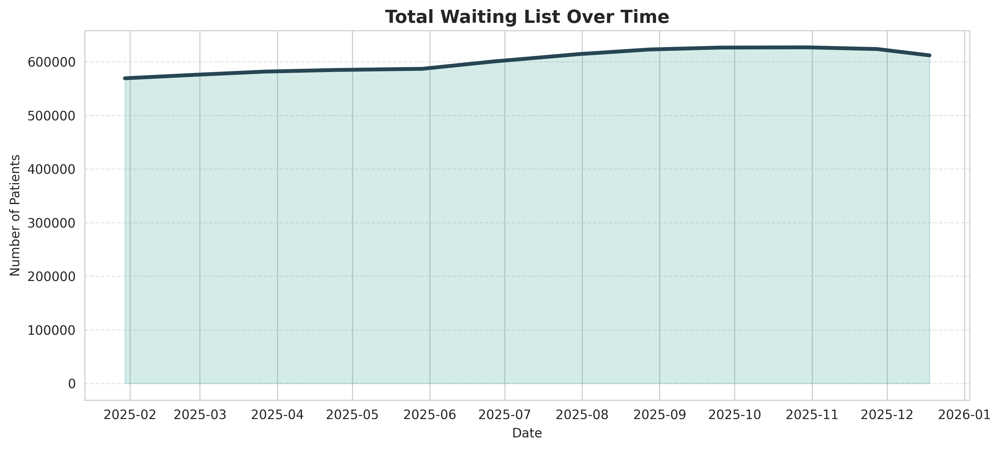
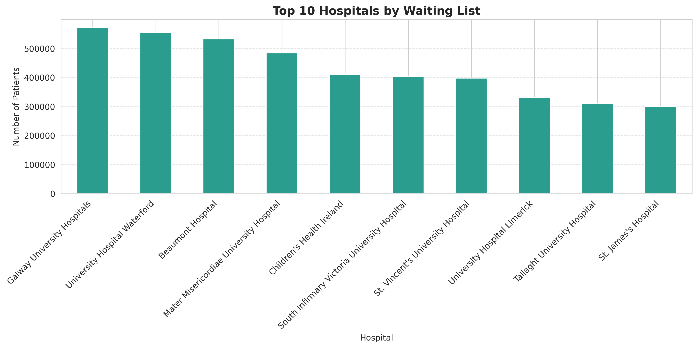
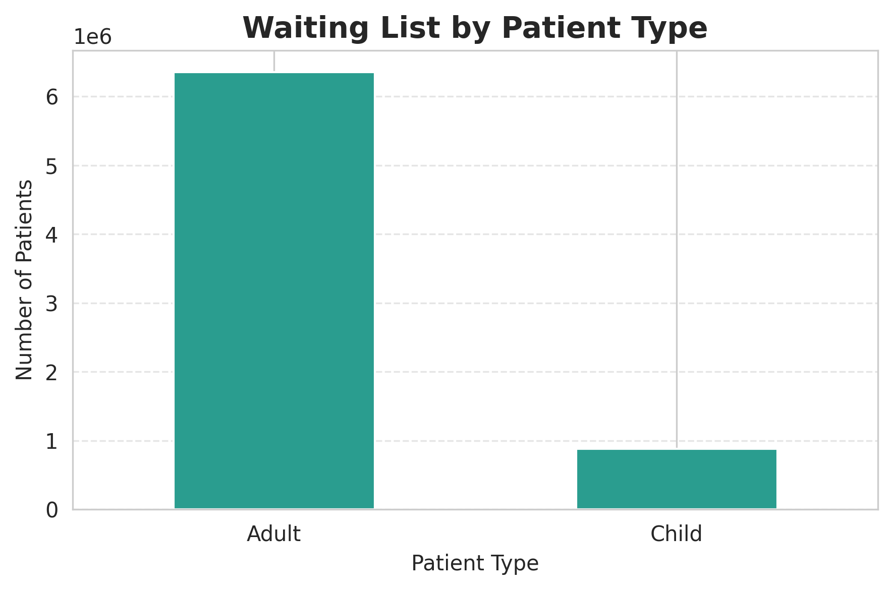

# Irish Hospital Waiting List Analysis

This project analyses Irish hospital outpatient waiting list data to examine patient waiting times across hospitals.

---

## Overview

The dataset includes the number of patients waiting in different time bands (0–6 months, 6–12 months, 12–18 months, and 18+ months), broken down by hospital and patient type (Adult/Child).

The analysis focuses on:
- Distribution of waiting lists across hospitals  
- Long waiting times (18+ months)  
- Differences between Adult and Child patients  
- Trends in waiting lists over time  

---

## Tools Used

- Python  
- Pandas  
- Matplotlib  
- Seaborn  
- Google Colab  

---

## Key Findings

- A small number of hospitals account for a large proportion of total waiting list volumes  
- Long waiting times (18+ months) are concentrated in a small number of hospitals  
- Adult patients make up the majority of those waiting  
- The overall waiting list is increasing over time  

---

## Visualisations

### Total Waiting List Over Time

### Top 10 Hospitals by Waiting List

### Long Waiting Times (18+ Months)

### Waiting List by Patient Type

---

## Dataset

- Source: data.gov.ie  
- Dataset: Irish Hospital Waiting List Data  

---

## Notes

- Data required cleaning before analysis, including converting formatted numeric fields to numeric values  
- Analysis is based on aggregated data across the available time period  

---

## Author

Elizabeth Dunphy
